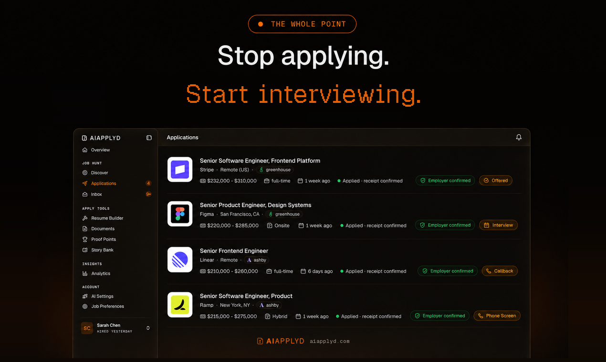
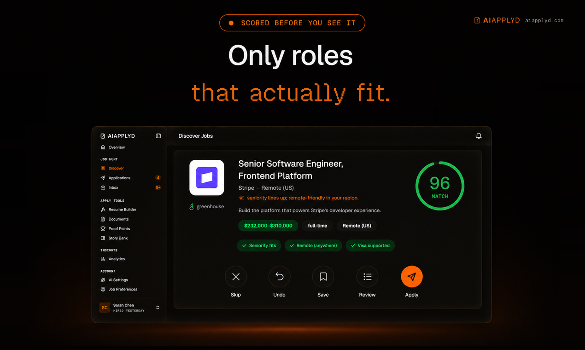
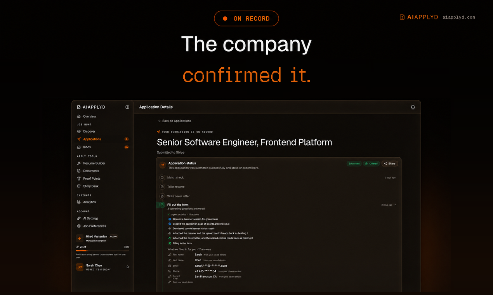
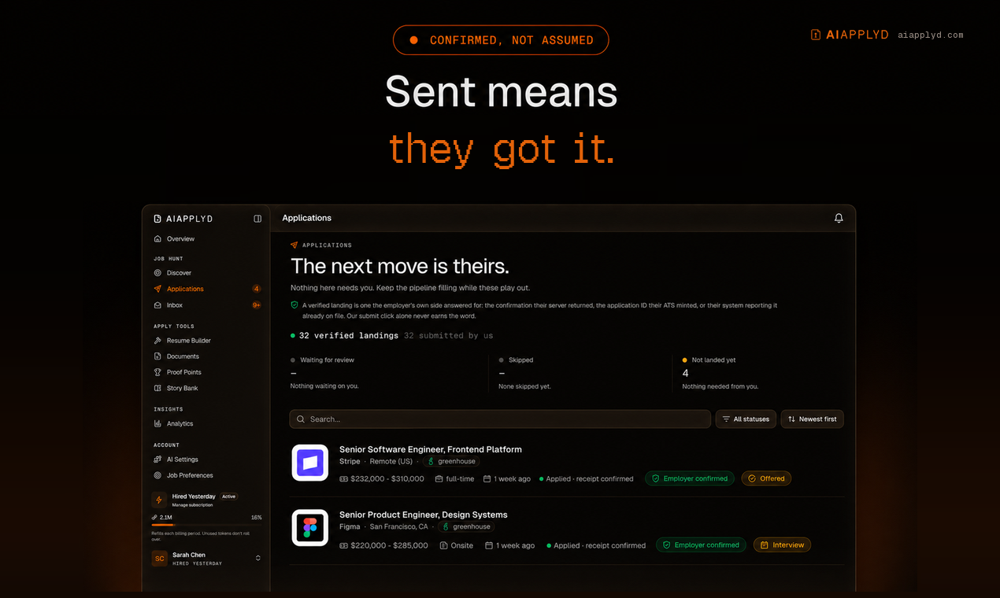
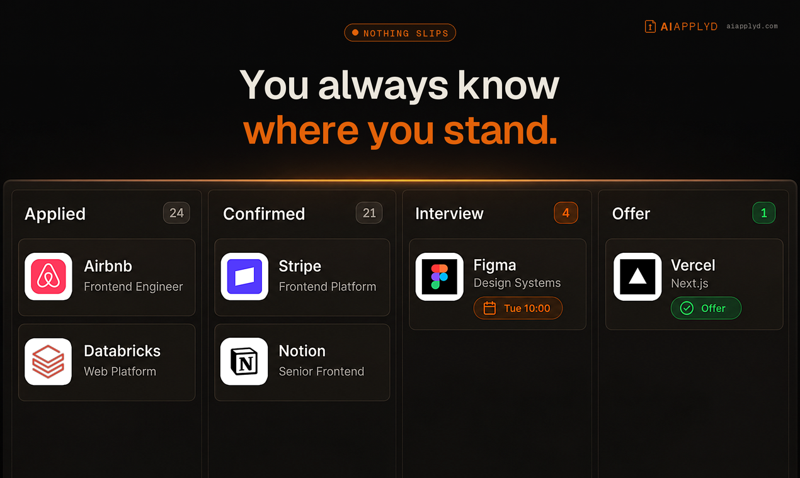
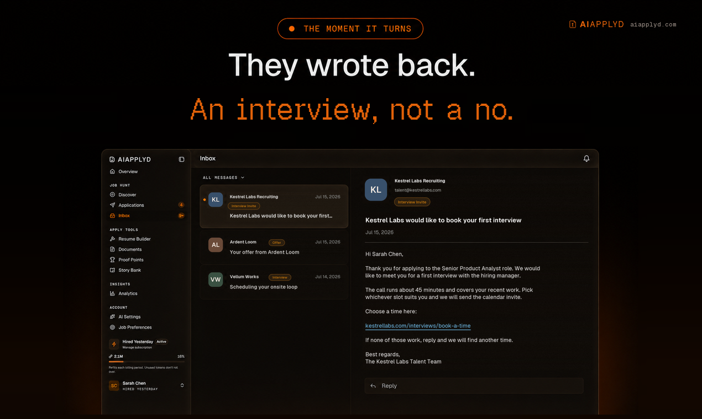
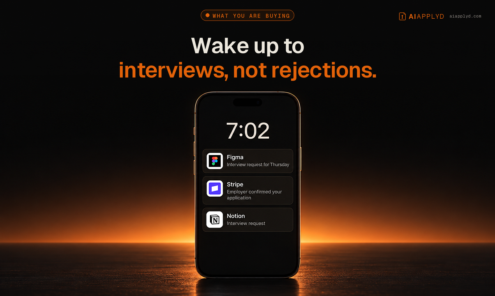

<div align="center">


# AI Applyd MCP Server

**Auto-Apply That Ends on an Interview**

**Stop applying. Start interviewing.**

Score your resume the way the screening software scores it, rewrite it for the exact role,
write the cover letter, prepare for the interview, and send the application in on the
employer's own hiring system. All from inside the assistant you already work in.

<br />



**And it keeps the employer's own confirmation.** Most tools count applications sent, which is
a number the tool awards itself off its own button click. This one reports what the employer's
system actually returned, so a real rejection is distinguishable from a form that quietly
dropped your application.

[](https://glama.ai/mcp/servers/aiapplyd/aiapplyd-mcp)
[](https://smithery.ai/servers/firstexhotic/aiapplyd)
[](https://registry.modelcontextprotocol.io/v0/servers?search=aiapplyd)
[](https://lobehub.com/mcp/aiapplyd-aiapplyd-mcp)
[](LICENSE)

**[Listing page](https://aiapplyd.com/mcps)** · **[Website](https://aiapplyd.com)** · **[Privacy](https://aiapplyd.com/legal/privacy)** · **[Terms](https://aiapplyd.com/legal/terms)**

</div>

---

Most applicants are screened out by software before a person reads a word, and a good number
are never screened at all, because the form silently dropped a required field or the upload
never attached. From the candidate's side those look identical to rejection, which is why so
many people rewrite a CV nobody ever read.

This server puts both halves of that process in your hands: the screening, and the proof that
the application arrived.

<div align="center">










<sub>From the first match to the interview invite. Every application carries the employer's own confirmation.</sub>

</div>

Every application goes in on the company's real careers page, under your name, with your own
materials. It lands on all fifteen major ATS platforms: **Workday, Greenhouse, Lever, Ashby,
Workable, iCIMS, Personio, Recruitee, Teamtailor, Rippling, Breezy, SmartRecruiters, BambooHR,
JazzHR and softgarden.**

Nothing to install. Connect once and run it from Claude, ChatGPT, Cursor or any MCP client.

## Quick start

AI Applyd is a **hosted remote MCP server**. Point your client at one URL:

```
https://mcp.aiapplyd.com/mcp
```

The first tool call opens an OAuth sign-in. Sign in with Google, and you are connected.
A free account needs no card and arrives with a one-time 10,000-token starter grant.

### Claude (web, Desktop, Code)

**Settings → Connectors → Add custom connector**

| Field | Value |
|---|---|
| Name | `AI Applyd` |
| Remote MCP server URL | `https://mcp.aiapplyd.com/mcp` |

In Claude Code, one line does it:

```bash
claude mcp add --transport http aiapplyd https://mcp.aiapplyd.com/mcp
```

### Cursor

`~/.cursor/mcp.json`:

```json
{
  "mcpServers": {
    "aiapplyd": {
      "url": "https://mcp.aiapplyd.com/mcp"
    }
  }
}
```

### ChatGPT

**Settings → Connectors → Create** and paste `https://mcp.aiapplyd.com/mcp`. ChatGPT speaks MCP
natively, so there is no Action schema to import and nothing to host.

### VS Code

```bash
code --add-mcp '{"name":"aiapplyd","type":"http","url":"https://mcp.aiapplyd.com/mcp"}'
```

### Any client that only speaks stdio

This repository ships a thin bridge. It relays the protocol to the hosted server and adds
nothing of its own.

```bash
npx -y github:aiapplyd/aiapplyd-mcp
```

Or with Docker:

```bash
docker build -t aiapplyd-mcp .
docker run --rm -i aiapplyd-mcp
```

```json
{
  "mcpServers": {
    "aiapplyd": {
      "command": "docker",
      "args": ["run", "--rm", "-i", "aiapplyd-mcp"]
    }
  }
}
```

| Environment variable | Default | Meaning |
|---|---|---|
| `AIAPPLYD_MCP_URL` | `https://mcp.aiapplyd.com/mcp` | Endpoint to relay to. Point it at `https://mcp-preview.aiapplyd.com/mcp` to test against preview. |
| `AIAPPLYD_TOKEN` | unset | Optional bearer token. Without it the server still answers introspection; tool **calls** return 401 until an account is connected. |

## Endpoints

| Environment | Streamable HTTP (modern) | SSE (legacy bridges) |
|---|---|---|
| Production | `https://mcp.aiapplyd.com/mcp` | `https://mcp.aiapplyd.com/sse` |
| Preview | `https://mcp-preview.aiapplyd.com/mcp` | `https://mcp-preview.aiapplyd.com/sse` |

Use `/mcp`. `/sse` remains only for clients that cannot speak Streamable HTTP.

## Tools

Ten tools. Every one runs on the caller's own AI Applyd account and spends that account's
own credits. The server holds no allowance of its own and there is no anonymous tool.

| Tool | Read-only | What you get |
|---|---|---|
| `aiapplyd_score_resume` | yes | An overall ATS score plus section scores, the keywords you match, the ones you are missing, and what to change |
| `aiapplyd_analyze_job_description` | yes | What the posting screens on, in its own language |
| `aiapplyd_generate_interview_questions` | yes | The questions this role is asked, with answer guidance and negotiation prep |
| `aiapplyd_search_jobs` | yes | The roles worth pursuing, scored against your profile |
| `aiapplyd_optimize_resume` | no | A resume that passes ATS screening and still reaches a human reader |
| `aiapplyd_translate_resume` | no | A send-ready resume in another language, formatted for that market |
| `aiapplyd_generate_cover_letter` | no | A cover letter in your own voice, from the resume already on your account |
| `aiapplyd_build_pdf` | no | A finished, ATS-clean resume, editable in the builder and ready to download |
| `aiapplyd_update_job_preferences` | **destructive** | Direct the search at the roles and locations you are targeting. A supplied list *replaces* the stored one. |
| `aiapplyd_auto_apply` | **destructive** | **One specific** job, applied for end to end on the employer's own system |

Every tool declares `readOnlyHint` and `destructiveHint`, so a client can tell at a glance
which calls change something in the world.

### Two behaviours worth knowing

- **`aiapplyd_search_jobs` never writes.** It reads your saved matches. To change what
  AI Applyd hunts for, call `aiapplyd_update_job_preferences`.
- **`aiapplyd_auto_apply` submits a real application to a real employer.** It follows the
  review setting already on your account: auto-approve submits on its own, co-pilot routes it
  to your review queue. It never changes that setting, and it never applies to anything but
  the one job URL you hand it.

## Prompts

| Prompt | What it does |
|---|---|
| `review_my_resume` | Scores a resume against a posting and returns the three changes that move it past the filter |
| `prepare_for_interview` | Prepares the questions this company asks, with structured answers ready |
| `find_jobs_like_this` | The strongest matches for a target role, ranked by fit |

## Resources

| Resource | Contents |
|---|---|
| `ats-best-practices` | Canonical ATS rules, keyword strategy, and formatting pitfalls |
| `interview-frameworks` | STAR, CARL, SOAR and PAR answer frameworks for behavioural interviews |
| `resume-section-order` | Optimal resume section order by career stage |

## Authentication

OAuth 2.1, and it is the full specification rather than a subset:

- PKCE with S256, mandatory
- Dynamic Client Registration ([RFC 7591](https://www.rfc-editor.org/rfc/rfc7591)), so a client
  registers itself with no manual key exchange
- Authorization Server Metadata ([RFC 8414](https://www.rfc-editor.org/rfc/rfc8414)) and
  Protected Resource Metadata ([RFC 9728](https://www.rfc-editor.org/rfc/rfc9728)) discovery
- Token revocation ([RFC 7009](https://www.rfc-editor.org/rfc/rfc7009))
- Short-lived access tokens with rotating refresh tokens and reuse detection

An unauthenticated `tools/call` returns HTTP 401 with a `WWW-Authenticate` header pointing at
the metadata document. Introspection (`initialize`, `tools/list`, `prompts/list`,
`resources/list`) is open, so any directory or client can read the tool surface before a user
signs in.

## Verify it yourself

```bash
SID=$(curl -s -D- -o /dev/null -X POST https://mcp.aiapplyd.com/mcp \
  -H 'Content-Type: application/json' \
  -H 'Accept: application/json, text/event-stream' \
  -d '{"jsonrpc":"2.0","id":1,"method":"initialize","params":{"protocolVersion":"2025-06-18","capabilities":{},"clientInfo":{"name":"probe","version":"1"}}}' \
  | grep -i '^mcp-session-id' | tr -d '\r' | awk '{print $2}')

curl -s -X POST https://mcp.aiapplyd.com/mcp \
  -H 'Content-Type: application/json' \
  -H 'Accept: application/json, text/event-stream' \
  -H "Mcp-Session-Id: $SID" \
  -d '{"jsonrpc":"2.0","id":2,"method":"tools/list"}'
```

## Privacy

Your resume and profile stay on your AI Applyd account. Tools read and write that account and
nothing else. The [privacy policy](https://aiapplyd.com/legal/privacy) and
[terms](https://aiapplyd.com/legal/terms) are the binding statement.

## Support

- Issues: [github.com/aiapplyd/aiapplyd-mcp/issues](https://github.com/aiapplyd/aiapplyd-mcp/issues)
- Email: admin@aiapplyd.com

## Follow AI Applyd

- Website: [aiapplyd.com](https://aiapplyd.com)
- Pricing: [aiapplyd.com/pricing](https://aiapplyd.com/pricing)
- Blog: [aiapplyd.com/blog](https://aiapplyd.com/blog)
- X: [@aiapplydHQ](https://x.com/aiapplydHQ)
- LinkedIn: [AI Applyd](https://www.linkedin.com/company/aiapplyd/)
- YouTube: [@aiapplyd](https://www.youtube.com/@aiapplyd)
- TikTok: [@aiapplydhq](https://www.tiktok.com/@aiapplydhq)
- Instagram: [@aiapplyd](https://www.instagram.com/aiapplyd)
- Discord: [join the community](https://discord.gg/ZXBsKvuvCD)

## About this repository

The hosted server runs on Cloudflare Workers and its source is not public. This repository is
the public home of the MCP server: the `server.json` manifest, the connection documentation,
and the small stdio bridge above. The bridge is MIT licensed and forwards messages verbatim,
so you can read every line of what runs on your machine.

---

## More from AI Applyd

- [AI Applyd](https://aiapplyd.com) - auto-apply that ends on an interview
- [How the MCP server works](https://aiapplyd.com/mcps) - setup for Claude, ChatGPT and Cursor
- [Pricing](https://aiapplyd.com/pricing) - free to start, no card
- [Blog](https://aiapplyd.com/blog) - how hiring systems actually screen you
- [FAQ](https://aiapplyd.com/faq) - resume parsing, ATS behaviour, what "application received" means
- [Compare](https://aiapplyd.com/vs) - AI Applyd against the other job-application tools
- [Four things that cost us money while automating job applications](https://dev.to/aiapplyd/four-things-that-cost-us-money-while-automating-job-applications-1l51) - engineering write-up

Built by [AI Applyd](https://aiapplyd.com). Questions: [ava@aiapplyd.com](mailto:ava@aiapplyd.com)
