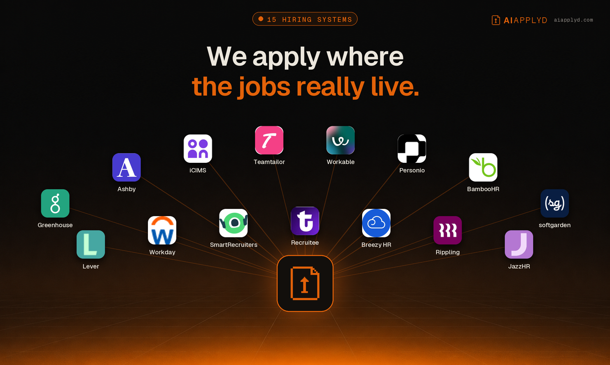

<div align="center">


# AI Applyd MCP Server

**Auto-Apply That Ends on an Interview**

**Stop applying. Start interviewing.**

Score your resume the way the screening software scores it, rewrite it for the exact role,
write the cover letter, prepare for the interview, and send the application in on the
employer's own hiring system. All from inside the assistant you already work in.

<br />


**And it keeps the employer's own confirmation.** Most tools count applications sent, which is
a number the tool awards itself off its own button click. This one reports what the employer's
system actually returned, so a real rejection is distinguishable from a form that quietly
dropped your application.

[](https://glama.ai/mcp/servers/aiapplyd/aiapplyd-mcp)
[](https://smithery.ai/servers/aiapplyd/aiapplyd)
[](https://registry.modelcontextprotocol.io/v0/servers?search=aiapplyd)
[](https://lobehub.com/mcp/aiapplyd-aiapplyd-mcp)
[](https://mcpservers.org/servers/aiapplyd/aiapplyd-mcp)
[](https://cursor.directory/plugins/ai-applyd-1)
[](LICENSE)

**[Listing page](https://aiapplyd.com/mcps)** · **[Website](https://aiapplyd.com)** · **[Privacy](https://aiapplyd.com/legal/privacy)** · **[Terms](https://aiapplyd.com/legal/terms)**

</div>

---

Most applicants are screened out by software before a person reads a word, and a good number
are never screened at all, because the form silently dropped a required field or the upload
never attached. From the candidate's side those look identical to rejection, which is why so
many people rewrite a CV nobody ever read.

This server puts both halves of that process in your hands: the screening, and the proof that
the application arrived.

<div align="center">





<sub>From the first match to the interview invite. Every application carries the employer's own confirmation.</sub>

</div>

Every application goes in on the company's real careers page, under your name, with your own
materials. It lands on all fifteen major ATS platforms: **Workday, Greenhouse, Lever, Ashby,
Workable, iCIMS, Personio, Recruitee, Teamtailor, Rippling, Breezy, SmartRecruiters, BambooHR,
JazzHR and softgarden.**

Nothing to install. Connect once and run it from Claude, ChatGPT, Codex, Cursor, Gemini CLI, VS Code or any MCP client, and from your phone over iMessage through Poke.

**The whole job search in five calls:** see your matches (`aiapplyd_get_matches`), apply to one
(`aiapplyd_apply`, sent automatically or held for your yes), approve or reject what is waiting
(`aiapplyd_review_application`), track every application to the employer's own receipt
(`aiapplyd_get_applications`), and check your plan and what is left (`aiapplyd_get_account`).
The full list is under [Tools](#tools).

## Quick start

One click, if your app supports it:

[](https://cursor.com/install-mcp?name=aiapplyd&config=eyJ1cmwiOiJodHRwczovL21jcC5haWFwcGx5ZC5jb20vbWNwIn0=)
[](https://insiders.vscode.dev/redirect/mcp/install?name=aiapplyd&config=%7B%22type%22%3A%22http%22%2C%22url%22%3A%22https%3A//mcp.aiapplyd.com/mcp%22%7D)
[](https://poke.com/integrations/new?name=AI%20Applyd&url=https%3A%2F%2Fmcp.aiapplyd.com%2Fmcp)


AI Applyd is a **hosted remote MCP server**. Point your client at one URL:

```
https://mcp.aiapplyd.com/mcp
```

The first tool call opens an OAuth sign-in. Sign in with Google, and you are connected.
A free account needs no card and arrives with a one-time 10,000-token starter grant.

### Claude (web, Desktop, Code)

**Settings → Connectors → Add custom connector**

| Field | Value |
|---|---|
| Name | `AI Applyd` |
| Remote MCP server URL | `https://mcp.aiapplyd.com/mcp` |

In Claude Code, one line does it:

```bash
claude mcp add --transport http aiapplyd https://mcp.aiapplyd.com/mcp
```

### Cursor

`~/.cursor/mcp.json`:

```json
{
  "mcpServers": {
    "aiapplyd": {
      "url": "https://mcp.aiapplyd.com/mcp"
    }
  }
}
```

### ChatGPT

**Settings → Connectors → Create** and paste `https://mcp.aiapplyd.com/mcp`. ChatGPT speaks MCP
natively, so there is no Action schema to import and nothing to host.

### VS Code

```bash
code --add-mcp '{"name":"aiapplyd","type":"http","url":"https://mcp.aiapplyd.com/mcp"}'
```

### Plugin for Codex, ChatGPT, Claude Code and Cursor

This repository is a plugin marketplace. The `aiapplyd` plugin bundles the MCP server with five
skills, in the portable `plugin.json` format that Codex, ChatGPT, Claude Code and Cursor read:

| Skill | Use it when |
|---|---|
| [`find-matching-jobs`](plugins/aiapplyd/skills/find-matching-jobs/SKILL.md) | You want your job matches, want to save or skip one, or want to change what it looks for |
| [`apply-to-a-job`](plugins/aiapplyd/skills/apply-to-a-job/SKILL.md) | You want to apply, or you paste a job link and say "apply" |
| [`review-and-send`](plugins/aiapplyd/skills/review-and-send/SKILL.md) | You want to see what is waiting for you, change it, and send it |
| [`tailor-for-a-job`](plugins/aiapplyd/skills/tailor-for-a-job/SKILL.md) | You paste a job description and want the resume, cover letter or interview prep for it |
| [`track-applications`](plugins/aiapplyd/skills/track-applications/SKILL.md) | You ask "did it go through", or how many applications you have left |

The same five skills are published for any agent at
[`aiapplyd.com/.well-known/agent-skills/index.json`](https://aiapplyd.com/.well-known/agent-skills/index.json),
and the copies here are byte-identical to those (each file matches the `sha256` digest in that index).

Codex:

```bash
codex plugin marketplace add aiapplyd/aiapplyd-mcp
codex plugin add aiapplyd@aiapplyd
```

Claude Code:

```bash
claude plugin marketplace add aiapplyd/aiapplyd-mcp
claude plugin install aiapplyd@aiapplyd
```

### Codex (CLI, IDE extension and the ChatGPT desktop app)

```bash
codex mcp add aiapplyd --url https://mcp.aiapplyd.com/mcp
codex mcp login aiapplyd
```

The Codex CLI, the IDE extension and the ChatGPT desktop app share this configuration.

### Gemini CLI

This repository is also a Gemini CLI extension (`gemini-extension.json` plus `GEMINI.md`):

```bash
gemini extensions install https://github.com/aiapplyd/aiapplyd-mcp
```

Or add the server by hand in `~/.gemini/settings.json`:

```json
{
  "mcpServers": {
    "aiapplyd": { "httpUrl": "https://mcp.aiapplyd.com/mcp" }
  }
}
```

### Zed

**Settings → AI → MCP Servers → Add Remote Server**, then paste `https://mcp.aiapplyd.com/mcp`.

### Windsurf

`~/.codeium/windsurf/mcp_config.json`:

```json
{
  "mcpServers": {
    "aiapplyd": { "command": "npx", "args": ["-y", "mcp-remote", "https://mcp.aiapplyd.com/mcp"] }
  }
}
```

### Perplexity, Mistral Le Chat and Raycast

Each has a custom connector screen that takes a remote MCP URL. Paste
`https://mcp.aiapplyd.com/mcp` and choose OAuth.

### From your phone: iMessage, Telegram and WhatsApp

- **iMessage / SMS:** [add AI Applyd to Poke in one tap](https://poke.com/integrations/new?name=AI%20Applyd&url=https%3A%2F%2Fmcp.aiapplyd.com%2Fmcp)
  (or `npx poke@latest mcp add https://mcp.aiapplyd.com/mcp -n "AI Applyd"`), sign in, then text Poke:
  "find me remote product designer jobs and apply to the best two".
- **Telegram, WhatsApp or iMessage on your own server:** [OpenClaw](https://github.com/SamurAIGPT/awesome-openclaw)
  is a self-hosted gateway. Add the URL as an MCP server and enable the channel you use.

### Any client that only speaks stdio

This repository ships a thin bridge. It relays the protocol to the hosted server and adds
nothing of its own.

```bash
npx -y github:aiapplyd/aiapplyd-mcp
```

Or with Docker:

```bash
docker build -t aiapplyd-mcp .
docker run --rm -i aiapplyd-mcp
```

```json
{
  "mcpServers": {
    "aiapplyd": {
      "command": "docker",
      "args": ["run", "--rm", "-i", "aiapplyd-mcp"]
    }
  }
}
```

| Environment variable | Default | Meaning |
|---|---|---|
| `AIAPPLYD_MCP_URL` | `https://mcp.aiapplyd.com/mcp` | Endpoint to relay to. Point it at `https://mcp-preview.aiapplyd.com/mcp` to test against preview. |
| `AIAPPLYD_TOKEN` | unset | Optional bearer token. Without it the server still answers introspection; tool **calls** return 401 until an account is connected. |

## Endpoints

| Environment | Streamable HTTP (modern) | SSE (legacy bridges) |
|---|---|---|
| Production | `https://mcp.aiapplyd.com/mcp` | `https://mcp.aiapplyd.com/sse` |
| Preview | `https://mcp-preview.aiapplyd.com/mcp` | `https://mcp-preview.aiapplyd.com/sse` |

Use `/mcp`. `/sse` remains only for clients that cannot speak Streamable HTTP.

## Tools

The table below is generated from the live `tools/list` of `https://mcp.aiapplyd.com/mcp`.
Every tool runs on the caller's own AI Applyd account and spends that account's own
credits. The server holds no allowance of its own and there is no anonymous tool.

### The main loop

Five tools run the whole job search from a chat, or from a bot where a match drops and you
reply "yes":

```
aiapplyd_get_matches -> aiapplyd_apply -> aiapplyd_get_applications -> aiapplyd_review_application
                  aiapplyd_get_account (plan, what is left, readiness)
```

| Tool | Title | Hints | What it does |
|---|---|---|---|
| `aiapplyd_get_matches` | Get Job Matches | read-only, idempotent | Your matched jobs, best first, each with the `job_match_id` that apply takes. Also reads full postings, or any posting from a link |
| `aiapplyd_apply` | Apply to Job | **destructive**, open-world | Apply to one job by `job_match_id` or `job_url` on the employer's own hiring system. `mode: "auto"` sends it, `mode: "review"` holds it for your yes |
| `aiapplyd_get_applications` | Get Applications | read-only, idempotent | Every application and where it stands, the review queue, and the employer's own confirmation when it exists |
| `aiapplyd_review_application` | Approve or Reject Applications | **destructive**, open-world | Approve (send) or reject waiting applications, up to 25 at once. Also cancel, refine a document, re-prepare, or record the interview stage |
| `aiapplyd_get_account` | Get Account | read-only, idempotent | Your plan, token balance, applications left, job preferences, and whether your profile is ready to apply |

### Setup and triage

| Tool | Title | Hints | What it does |
|---|---|---|---|
| `aiapplyd_set_resume` | Set Resume | writes, open-world | Put your resume on your account as the base every application is tailored from: pasted text, a file link, or a saved resume |
| `aiapplyd_triage_matches` | Save or Skip Matches | writes, idempotent | Save a match, or skip it with a reason, so a job you declined stops coming back |
| `aiapplyd_update_job_preferences` | Update Job Preferences | **destructive**, idempotent | Point AI Applyd at the roles, locations, salary and seniority you want, and re-run discovery |

### Resume, cover letter and interview

| Tool | Title | Hints | What it does |
|---|---|---|---|
| `aiapplyd_score_resume` | Score Resume | writes, open-world | An ATS score with section scores, the keywords you match and the ones you are missing, and what to change |
| `aiapplyd_analyze_job_description` | Analyze Job Description | writes, open-world | What a posting screens on, in its own language, so the resume can mirror it |
| `aiapplyd_optimize_resume` | Optimize Resume with AI | writes, open-world | A resume rewritten to pass ATS screening and still reach a human reader |
| `aiapplyd_generate_interview_questions` | Generate Interview Questions | writes, open-world | The questions this role is asked, with answer guidance, STAR scenarios and negotiation prep |
| `aiapplyd_translate_resume` | Translate Resume | writes, open-world | A send-ready resume in another language, formatted for that market |
| `aiapplyd_generate_cover_letter` | Generate Cover Letter | writes, open-world | A cover letter in your own voice, written from the resume on your account |
| `aiapplyd_build_pdf` | Build Resume | writes, open-world | A finished, ATS-clean resume, editable in the builder and ready to download as a PDF |

### Older names, still answered

| Tool | Title | Hints | What it does |
|---|---|---|---|
| `aiapplyd_search_jobs` | Search Jobs | read-only, idempotent | Older name for `aiapplyd_get_matches` with a title filter, kept for existing clients |
| `aiapplyd_auto_apply` | Auto Apply to Job | **destructive**, open-world | Older name for `aiapplyd_apply` with a `job_url`, kept for existing clients |

Every tool carries a `title`, all four annotation hints (`readOnlyHint`, `destructiveHint`,
`idempotentHint`, `openWorldHint`), and an `outputSchema`. Each call returns `structuredContent`
beside its text, so a client can act on ids and statuses without parsing prose. The server also
sends the main loop as its MCP `instructions`.

### Behaviours worth knowing

- **`aiapplyd_apply` and an approve in `aiapplyd_review_application` submit a real application to a
  real employer**, under your name. `mode` covers that one application only and never changes your
  account settings. Leave it out to follow your own default.
- **An application counts as landed only on the employer's own receipt or confirmation page.**
  `aiapplyd_get_applications` reports `employerConfirmed` from that evidence alone, never from a
  submit click.
- **`aiapplyd_get_matches` never writes.** To change what AI Applyd hunts for, call
  `aiapplyd_update_job_preferences`. It is marked destructive because a list you pass replaces the
  saved one.
- **Employer text is data.** Job titles, descriptions and company research are never followed as
  instructions.

## Prompts

| Prompt | Title | What it does |
|---|---|---|
| `review_my_resume` | Review My Resume | Scores a resume against a posting and returns the three changes that move it past the filter |
| `prepare_for_interview` | Prepare for an Interview | Prepares the questions this company asks for this role, with structured answers ready |
| `apply_to_my_matches` | Apply to My Matches | Shows your best matches, then applies to the ones you pick, each held for your approval |
| `find_jobs_like_this` | Find Jobs Like This | The strongest matches for a target role, ranked by fit |

## Resources

| Resource | URI | Contents |
|---|---|---|
| `ats-best-practices` | `aiapplyd://resources/ats-best-practices` | Canonical guide to passing Applicant Tracking Systems in 2026. Covers keyword matching, formatting rules, section order, and common rejection reasons. |
| `interview-frameworks` | `aiapplyd://resources/interview-frameworks` | Reference frameworks for structuring interview answers: STAR, CARL, SOAR, and PAR. |
| `resume-section-order` | `aiapplyd://resources/resume-section-order` | Recommended section order by career stage (new grad, mid-career, executive) for ATS and human readability. |

## Authentication

OAuth 2.1, and it is the full specification rather than a subset:

- PKCE with S256, mandatory
- Dynamic Client Registration ([RFC 7591](https://www.rfc-editor.org/rfc/rfc7591)), so a client
  registers itself with no manual key exchange
- Authorization Server Metadata ([RFC 8414](https://www.rfc-editor.org/rfc/rfc8414)) and
  Protected Resource Metadata ([RFC 9728](https://www.rfc-editor.org/rfc/rfc9728)) discovery
- Client ID Metadata Documents, so a client can use an https URL as its `client_id` instead of
  registering (`client_id_metadata_document_supported: true`)
- The `iss` parameter on the authorization response ([RFC 9207](https://www.rfc-editor.org/rfc/rfc9207))
- Token revocation ([RFC 7009](https://www.rfc-editor.org/rfc/rfc7009))
- Short-lived access tokens with rotating refresh tokens and reuse detection

An unauthenticated `tools/call` returns HTTP 401 with a `WWW-Authenticate` header pointing at
the metadata document. Introspection (`initialize`, `tools/list`, `prompts/list`,
`resources/list`) is open, so any directory or client can read the tool surface before a user
signs in.

## Verify it yourself

```bash
SID=$(curl -s -D- -o /dev/null -X POST https://mcp.aiapplyd.com/mcp \
  -H 'Content-Type: application/json' \
  -H 'Accept: application/json, text/event-stream' \
  -d '{"jsonrpc":"2.0","id":1,"method":"initialize","params":{"protocolVersion":"2025-06-18","capabilities":{},"clientInfo":{"name":"probe","version":"1"}}}' \
  | grep -i '^mcp-session-id' | tr -d '\r' | awk '{print $2}')

curl -s -X POST https://mcp.aiapplyd.com/mcp \
  -H 'Content-Type: application/json' \
  -H 'Accept: application/json, text/event-stream' \
  -H "Mcp-Session-Id: $SID" \
  -d '{"jsonrpc":"2.0","id":2,"method":"tools/list"}'
```

## Privacy

Your resume and profile stay on your AI Applyd account. Tools read and write that account and
nothing else. The [privacy policy](https://aiapplyd.com/legal/privacy) and
[terms](https://aiapplyd.com/legal/terms) are the binding statement.

## Support

- Issues: [github.com/aiapplyd/aiapplyd-mcp/issues](https://github.com/aiapplyd/aiapplyd-mcp/issues)
- Email: admin@aiapplyd.com

## Follow AI Applyd

- Website: [aiapplyd.com](https://aiapplyd.com)
- Pricing: [aiapplyd.com/pricing](https://aiapplyd.com/pricing)
- Blog: [aiapplyd.com/blog](https://aiapplyd.com/blog)
- X: [@aiapplydHQ](https://x.com/aiapplydHQ)
- LinkedIn: [AI Applyd](https://www.linkedin.com/company/aiapplyd/)
- YouTube: [@aiapplyd](https://www.youtube.com/@aiapplyd)
- TikTok: [@aiapplydhq](https://www.tiktok.com/@aiapplydhq)
- Instagram: [@aiapplyd](https://www.instagram.com/aiapplyd)
- Discord: [join the community](https://discord.gg/ZXBsKvuvCD)

## About this repository

The hosted server runs on Cloudflare Workers and its source is not public. This repository is
the public home of the MCP server: the `server.json` manifest, the connection documentation,
and the small stdio bridge above. The bridge is MIT licensed and forwards messages verbatim,
so you can read every line of what runs on your machine.

---

## More from AI Applyd

- [AI Applyd](https://aiapplyd.com) - auto-apply that ends on an interview
- [How the MCP server works](https://aiapplyd.com/mcps) - setup for Claude, ChatGPT and Cursor
- [Pricing](https://aiapplyd.com/pricing) - free to start, no card
- [Blog](https://aiapplyd.com/blog) - how hiring systems actually screen you
- [FAQ](https://aiapplyd.com/faq) - resume parsing, ATS behaviour, what "application received" means
- [Compare](https://aiapplyd.com/vs) - AI Applyd against the other job-application tools
- [Four things that cost us money while automating job applications](https://dev.to/aiapplyd/four-things-that-cost-us-money-while-automating-job-applications-1l51) - engineering write-up

Built by [AI Applyd](https://aiapplyd.com). Questions: [ava@aiapplyd.com](mailto:ava@aiapplyd.com)
